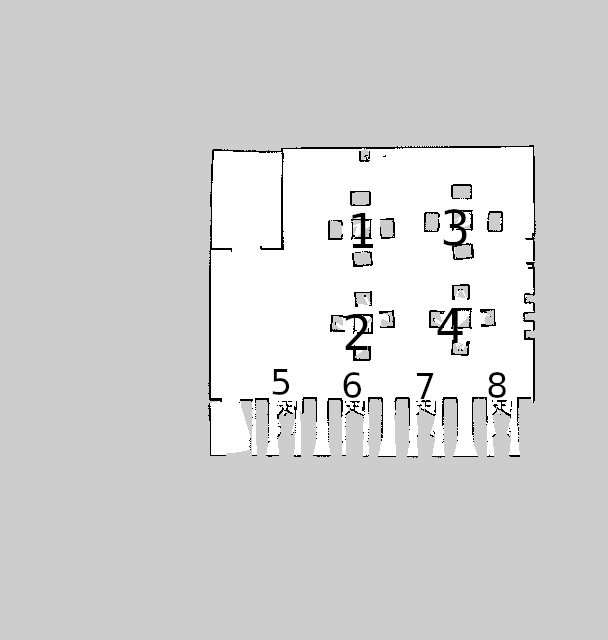
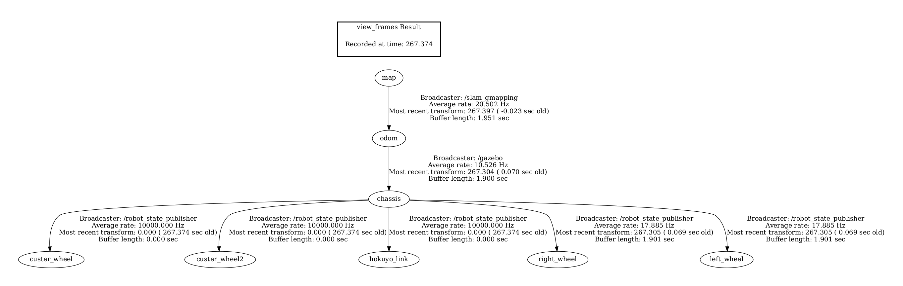

# waiter_robot_ROS
This repo contains a ros package for a waiter robot in a gazebo world using navigation stack in ROS1 noetic.

## **Features**

- **Autonomous Navigation**: Robot navigates autonomously to specific tables or the kitchen using the Navigation Stack.
- **Order Management**: GUI for placing orders, start navigation, viewing active orders, and requesting bills.

---

## **Implementation Steps**

### 1. **Navigation Stack**
- **Mapping**: A map of the restaurant is created using `SLAM`, highlighting table locations and the kitchen.
- **Localization**: `AMCL` is used to localize the robot on the map.
- **Path Planning**: The `move_base` node plans paths to reach destinations.

### 2. **Custom Messages,Topics, Service, Params**
#### Custom Messages
- **`order_msg.msg`**  
  - `string table_id`  
  - `menu_item[] items`

- **`menu_item.msg`**  
  - `string name`  
  - `float32 price`

#### Custom Topics
- **`/order_topic`**: Publishes new orders.  
  - Publisher: gui 
  - Subscriber: order_sub (collect orders in a list, waiting for delivery), orders_manager (store each new order in the /orders param in the paramater server, useful for calculating bills later)

#### Custom Params
- **`/positions**: store tables and kitchen positions (fixed).
  - `'table_1': { x: -1.7064523696899414, y: 2.242896556854248, z: 0.05 }`
  - `'table_2': { x: -1.9537034034729004, y: 2.208613395690918 , z: 0.05 }`
  - `...`

- **`/orders**: store all active orders not paid yet.
  - `table_1 : [{name: 'pizza', price: 5.0}, {name: 'lasagna', price: '7.0'}]`
  - `...`

#### Custom Service
- **`request_bill.srv`**
  - `string table_id`
  - `---`
  - `bool success`
  - `float64 total`
  - `menu_item[] items`
  - `string message`

#### Custom Nodes
- **`order_pub.py`**:  node to publish new order on topic /order_topic
- **`order_sub.py`**:  node subscribed on /order_topic, receivce a new order, store it in a list, and when the user start the delivery through the gui it call the move_base client to start the navigation to the kitchen and to tables in the orders list, then clear the orders list.
- **`orders_manager.py`**:  node subscribed on /order_topic, receive a new order and store it in the /orders param
- **`request_bill_server.py`**:  server side for the request_bill service. Receive the table_id, retrieve table_id orders from /orders param, return the response containing order details and total to pay, remove the table_id from /orders.
- **`gui.py`**:  node containing the tkinter gui code. The gui contains:
  - a button for each table_id, once clicked it shows the menu loaded from a csv, and confirming the order trigger the publish_order method from the order_pub.py node.
  - a button to show active orders for each tables, retrived from /orders param
  - a button to start a delivery
  - a button to request bill for a specific table, calling the service server.
 
## **Generated map**
This is the map generated from the mapping phase using SLAM, annotated with tables id

## **Robot overview**
The robot frame is built around the main chassis. Hokuyo link here is the link associated to the hokuyo lidar, essential in the mapping and obstacle detection.

